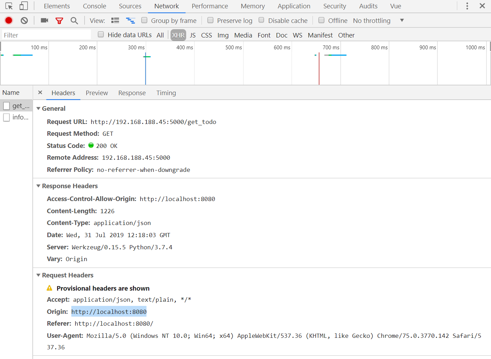

##### 跨域例子说明  
    
  使用Access-Control-Allow-Origin 和 Origin 能完成最简单的访问控制。Origin表明该请求来源于：http://localhost:8080 ，Access-Control-Allow-Origin：http://localhost:8080 表示仅允许该域的访问。若将Access-Control-Allow-Origin 设置为星号* 则表明该资源可以被任意外域访问。  
    
 Content-Type：设置资源的MIME类型（media type）。可取值仅限下列三者之一：  
 (1)text/plain  
 (2)multipart/form-data   
 (3)application/x-www-form-urlencoded  
   
 参考地址：https://developer.mozilla.org/zh-CN/docs/Web/HTTP/Access_control_CORS
