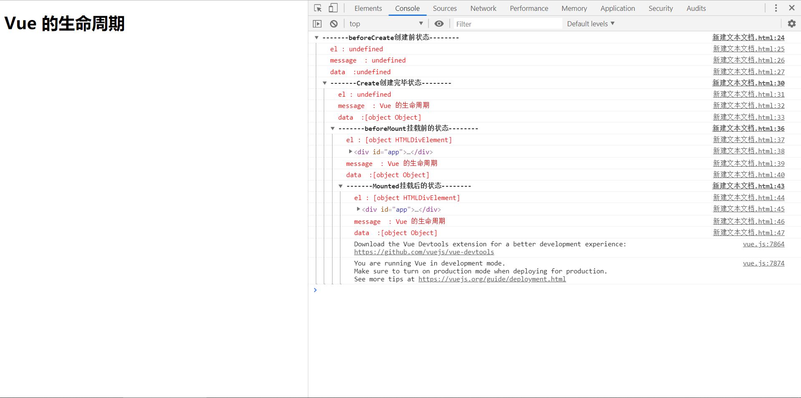

### vue 生命周期  
###### vue实例  
1. 每个vue应用都是通过 Vue 函数创建一个新的 Vue实例开始的；  
2. 当创建一个Vue实例时，你可以传入一个选项；  
```
var vm = new Vue ({
// 选项  
}) 
```  
选项指的是：  
（1）选项/数据：data，props，propsData，computed，methods，watch  
（2）选项/dom: el, template, render, renderError,   
（3）选项/生命周期钩子：beforeCreate, created, beforeMount, mounted, befroeUpdate, updated, activated, deactivated, beforeDestory, destroyed, errorCaptured  
（4）选项/资源：directives, filters, components  
（5）选项/组合: parent, mixins, extends, provide/inject,  
（6）选项/其他: name, delimiters, functional, model, inheritAttrs, comments  
3. 一个Vue应用由一个通过new Vue 创建的根Vue实例，以及可以选的嵌套的、可复用的组件树组成；  
4. 当一个Vue实例被创建时，它将data 对象中的所有的属性加入到 vue 的响应式系统中。当这些属性的值发生改变时，视图将会产生‘响应’，即匹配更新为最新值；  
5. 每个 Vue 实例在被创建时都要经过一系列的初始化过程--例如，需要设置数据监听、编译模板、将实例挂载到DOM 并在数据变变化时更新DOM等。
同时在这个过程中也会运行一些叫做生命周期钩子的函数，这给了用户在不同阶段添加自己的代码的机会；  
6. 生命周期钩子的this上下文指向调用它的Vue实例；
#### 钩子函数  
```
beforeCreate
created
beforeMount
mounted
beforeUpdate
updated
beforeDestroy
destroyed
```  
运行以下代码  
```<!DOCTYPE html>
<html lang="en">

<head>
  <meta charset="UTF-8">
  <meta name="viewport" content="width=device-width, initial-scale=1.0">
  <meta http-equiv="X-UA-Compatible" content="ie=edge">
  <script src="https://cdn.bootcss.com/vue/2.4.2/vue.js"></script>
  <title>vue生命周期</title>
</head>

<body>
  <div id="app">
    <h1>{{message}}</h1>
  </div>
</body>
<script>
  var vm = new Vue({
    el: "#app",
    data: {
      message: 'Vue 的生命周期'
    },
    beforeCreate() {
      console.group('-------beforeCreate创建前状态--------');
      console.log("%c%s", "color: red", "el : " + this.$el);
      console.log("%c%s", "color: red", "message  : " + this.message);
      console.log("%c%s", "color: red", "data  :" + this.$data);
    },
    created() {
      console.group('-------Create创建完毕状态--------');
      console.log("%c%s", "color: red", "el : " + this.$el);
      console.log("%c%s", "color: red", "message  : " + this.message);
      console.log("%c%s", "color: red", "data  :" + this.$data);
    },
    beforeMount() {
      console.group('-------beforeMount挂载前的状态--------');
      console.log("%c%s", "color: red", "el : " + this.$el);
      console.log(this.$el);
      console.log("%c%s", "color: red", "message  : " + this.message);
      console.log("%c%s", "color: red", "data  :" + this.$data);
    },
    mounted() {
      console.group('-------Mounted挂载后的状态--------');
      console.log("%c%s", "color: red", "el : " + this.$el);
      console.log(this.$el);
      console.log("%c%s", "color: red", "message  : " + this.message);
      console.log("%c%s", "color: red", "data  :" + this.$data);
    },
    beforeUpdate: function () {
      console.group('beforeUpdate 更新前状态===============》');
      console.log("%c%s", "color:red", "el     : " + this.$el);
      console.log(this.$el);
      console.log("%c%s", "color:red", "data   : " + this.$data);
      console.log("%c%s", "color:red", "message: " + this.message);
    },
    updated: function () {
      console.group('updated 更新完成状态===============》');
      console.log("%c%s", "color:red", "el     : " + this.$el);
      console.log(this.$el);
      console.log("%c%s", "color:red", "data   : " + this.$data);
      console.log("%c%s", "color:red", "message: " + this.message);
    },
    beforeDestroy: function () {
      console.group('beforeDestroy 销毁前状态===============》');
      console.log("%c%s", "color:red", "el     : " + this.$el);
      console.log(this.$el);
      console.log("%c%s", "color:red", "data   : " + this.$data);
      console.log("%c%s", "color:red", "message: " + this.message);
    },
    destroyed: function () {
      console.group('destroyed 销毁完成状态===============》');
      console.log("%c%s", "color:red", "el     : " + this.$el);
      console.log(this.$el);
      console.log("%c%s", "color:red", "data   : " + this.$data);
      console.log("%c%s", "color:red", "message: " + this.message)
    }
  })

</script>

</html>
```
得到的结果如下:   
  
1. beforeCreate 和 created 钩子函数之间的生命周期  
进行初始化事件，数据的观测，在created 的时候数据已经和data 属性进行绑定了，放在data 中的属性当值发生改变时，视图也会改变；  
2. created 钩子函数和beforeMount 之间的生命周期  
首先判断对象是否有“el” 选项。如果有的话就继续向下编译，如果没有"el" 选项则停止编译，也意味着停止了生命周期，直到在该vue实例上调用vm.$mount(el)。若是注释掉  el:'#app', 那么执行到created的时候就停止了；如果后面继续调用vm.$mount(el)，可以发现代码继续向下执行了。接下来，是template参数选项的有无对生命周期的影响；  
（1）如果 vue 实例对象有template参数选项，则将其作为模板编译成render函数；  
（2）如果没有template选项，则将外部html作为模板进行编译  
（3）可见，template中的模板优先级要高于外部html；这下就知道为什么 el的判断要在 template 之前了，是因为vue需要通过el找到对应的outer template；  
在 vue 对象中还有一个render函数，它是以createElement作为参数，做渲染操作，并且可以直接嵌入jsx；  
```
new Vue({
  el: '#app',
  render: function(createElement) {
    return createElement('h1', 'this is createElement')
  }
 })
```
所以综合排名：render函数 > tempalte选项 > outerHTML  
3. beforeMount 和 mounted 钩子函数之间的生命周期  
此时是给vue实例对象添加$el成员，并且替换挂载的DOM元素，因为在beforeMount之前el还是undefined；  
4. mounted  
```
beforeMounted 时：
<div id='app'>
  <h1>{{ message }}</h1>
</div>

mounted 之后： 
<div id='app'>
  <h1>Vue的生命周期</h1>
</div>
```
在mounted之前h1还是通过{{message}}进行占位的，因为此时还未挂载在页面上，还是以JavaScript中的虚拟DOM形式存在的。在mounted之后h1中的内容才发生了改变；  
5. beforeUpdate和update期间的生命周期  
当vue发现data中的数据发生了改变，会触发对应组件的重新渲染  
6. beforeDestroy和destroyed钩子函数间的生命周期    
beforeDestroy钩子函数在实例销毁之前调用。在这一步，实例仍然完全可用。
destroyed钩子函数在Vue 实例销毁后调用。调用后，Vue 实例指示的所有东西都会解绑定，所有的事件监听器会被移除，所有的子实例也会被销毁。  
参考文章：https://segmentfault.com/a/1190000011381906

