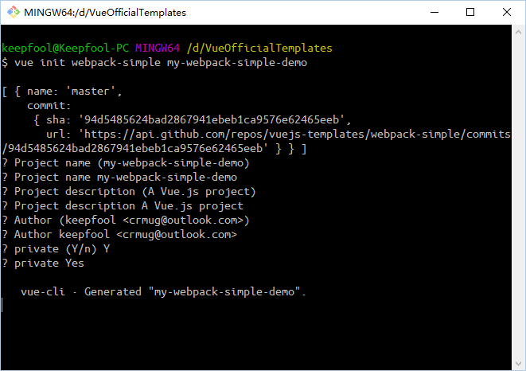
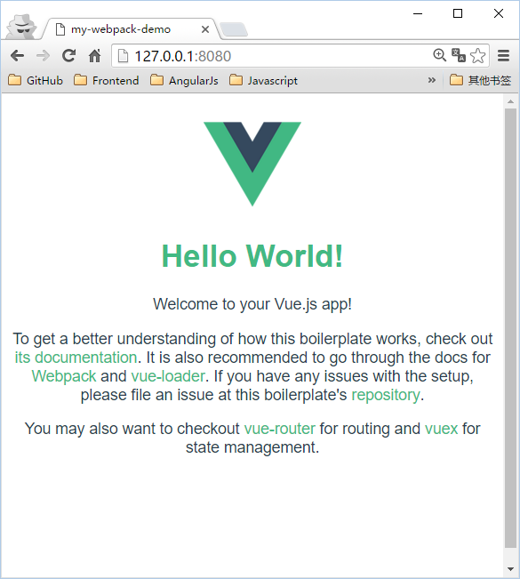
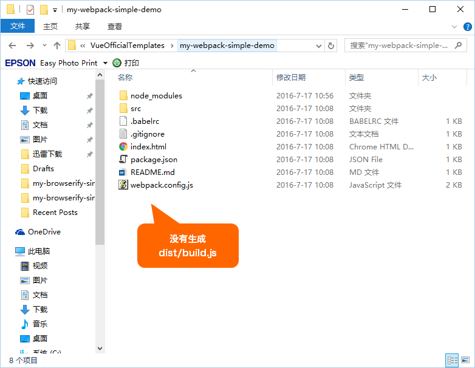
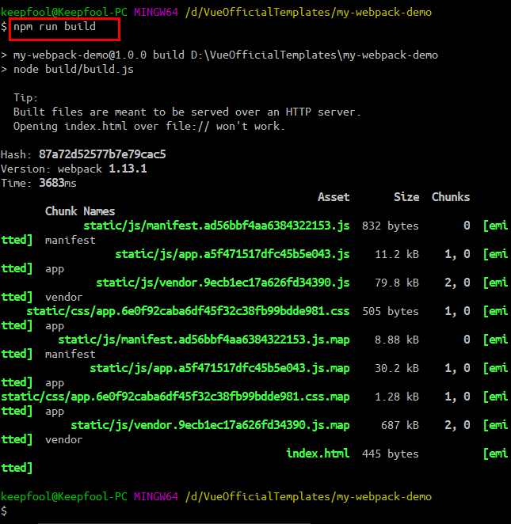
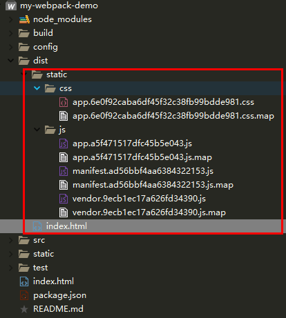

 ### 一、webpack 和 webpack-simple  
1. webpack  
（1）概念： webpack 是一个现代 JavaScript 应用程序的静态模块打包器（module bundler）。  
（2）四个核心概念：  
入口、输出、loader、插件   
2. webpack-simple  
webpack 的简化版本  
3. 二者区别  
参考地址： https://www.bbsmax.com/A/kjdwvnO5Np/?tdsourcetag=s_pctim_aiomsg  
（1）init 时默认配置的区别  
webpack-simple  
  
webpack 包括router  
  
（2）项目结构的区别  
webpack-simple  
   
webpack-simple 文件结构树：  
```
├─.babelrc		// babel配置文件
├─.gitignore
├─index.html		// 主页
├─package.json		// 项目配置文件
├─README.md
├─webpack.config.js	// webpack配置文件
├─dist			// 发布目录
│   ├─.gitkeep
├─src			// 开发目录
│   ├─App.vue		// App.vue组件
│   ├─main.js		// 预编译入口
```
webpack 文件树如下：  
```
├── build/                      # webpack config files
│   └── ...
├── config/
│   ├── index.js                # main project config
│   └── ...
├── src/
│   ├── main.js                 # app entry file
│   ├── App.vue                 # main app component
│   ├── components/             # ui components
│   │   └── ...
│   └── assets/                 # module assets (processed by webpack)
│       └── ...
├── static/                     # pure static assets (directly copied)
├── test/
│   └── unit/                   # unit tests
│   │   ├── specs/              # test spec files
│   │   ├── index.js            # test build entry file
│   │   └── karma.conf.js       # test runner config file
│   └── e2e/                    # e2e tests
│   │   ├── specs/              # test spec files
│   │   ├── custom-assertions/  # custom assertions for e2e tests
│   │   ├── runner.js           # test runner script
│   │   └── nightwatch.conf.js  # test runner config file
├── .babelrc                    # babel config
├── .editorconfig.js            # editor config
├── .eslintrc.js                # eslint config
├── index.html                  # index.html template
└── package.json                # build scripts and dependencies
```
（3）运行结果  
webpck-simple  
  
webpack  
  
webpack-simple 运行后目录  
  
（4）发布  
webpack-simple 执行npm run build 命令会生成发布时的build.js，并且是经过压缩的。  
  
webpack   
和vue-simple-webpack模板不同的是，所有的静态资源，包括index.html都生成到dist目录下了。
  
webpack-simple dist目录  
  
webpack dist 目录  
  
（5）loader 区别  
webpack-simple 在配置loader的时候可能与webpack存在一些差异，例如引入css文件时，webpack默认已安装css-loader，只需安装style-loader，并在loader中配置规则即可。而webpack-simple 可能既要下载 css-loader，又要下载 style-loader;  
