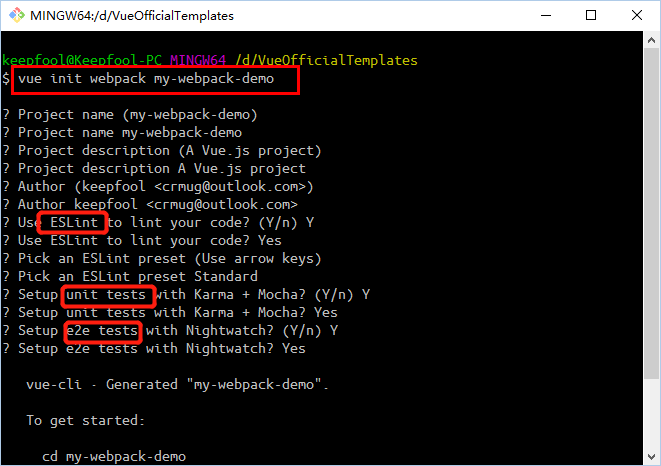

# 需求  
### 一、功能目录  
| 序号 | 模块 | 功能 | 优先级 | 需求说明 | 备注 |
| --- | --- | --- | --- | --- | --- | 
| 1 | 行为功能 | ①创建自定义清单 ②创建清单内的项 ③完成/取消清单内的项 ④删除清单内的项 | 高 | 见 [详细需求] | 见原型图 |
| 2 | 表现功能 | ①清单可拖动，自定义位置 ②排序，包括清单列表内的已完成和未完成任务的排序；③默认清单（todo），默认置顶于清单列表，且不可拖动；| 低 | 待完善 | 待完善 |
| 3 | 性能需求 | ①前端内容展现应保证用户在WIFI及移动网络下阅读体验流畅；②用户在线时后台信息处理稳定且快速；等等 | 中 | 无 | 无 |
| 4 | 系统需求 | 兼容 windows、Android 、 IOS各系统版本 | 中 | 各种平台的网页版都能正常浏览 | 待定 |  
  
 ### 二、详细功能  
 ps: 由于习惯问题，以下【任务】即指清单列表内的项，【新建任务】即新建一条清单列表内的项；
 1. 创建自定义清单  
 （1）该Todo app 的默认清单为【Todo】清单，用户若无其他清单时，创建的任务默认归类在此清单（即【Todo】清单）下面。  
 （2） 用户可通过按钮【创建清单】来创建自定义的清单，创建成功后自动进入该清单下的任务列表，创建的新任务即归类于此清单内；（后期完善：所有自定义清单内的任务都自动加入到默认清单【Todo】中 ）  
 2. 创建新任务  
 （1）在输入框中输入新任务的内容，回车即可添加新任务。添加成功后，该新任务显示到任务列表的最上面，即未完成任务按创建时间倒序排列；注意: 未完成任务和已完成任务分开排序，已完成任务位于未完成任务的下方，各自内内部又按照创建时间倒序排列；  
 （2）任务状态转换  
    未完成 ->  已完成 ：任务完成后，点击对勾按钮，该条任务样式变为【划掉】，表示该任务已完成；  
    已完成 -> 未完成: 点击对勾按钮，【划掉】样式消失，该任务重新变为未完成状态；  
  （3）删除任务： 点击【删除】按钮，弹出对话框，提示是否确认删除此条任务；选择【取消】则退出对话框即可，选择【确定】则删除该条任务，该任务清单内不再显示该条任务；  
  3. 拖动清单位置  
  （1）为自定义清单添加拖动功能，拖动的目标是使清单的排列顺序可以发生变化，以达到自定义清单顺序的目的；
# 概要设计  
### 一、引言  
1. 编写目的：该说明书仅用于本人以及搭档开发时使用，针对开发的流程及开发细节进行归纳记录；  
2. 项目背景：该项目只是作为学习的练手项目，既不作为商用也不作为私用；  
### 二、任务概述  
1. 目标  
Todo雏形，具备todo app的基本功能  
2. 运行环境  
各种平台的网页版  
### 三、总体设计  
1.流程图  
### 四、技术选型  
1. 前端  
框架： vue  
UI框架： Element 
2. 后端  
框架：Flask  
3. 版本控制  
Git  

# 详细设计  
### 一、安装element  
1. npm 安装：npm i element-ui -S  
### 二、webpack 和 webpack-simple  
1. webpack  
（1）概念： webpack 是一个现代 JavaScript 应用程序的静态模块打包器（module bundler）。  
（2）四个核心概念：  
入口、输出、loader、插件
入口（entry）  
2. webpack-simple  
webpack 的简化版本  
3. 二者区别  
参考地址： https://www.bbsmax.com/A/kjdwvnO5Np/?tdsourcetag=s_pctim_aiomsg  
（1）init 时默认配置的区别  
webpack-simple  
  
webpack  
  
（2）项目结构的区别  
webpack-simple  
   
webpack-simple 文件结构树：  
```
├─.babelrc		// babel配置文件
├─.gitignore
├─index.html		// 主页
├─package.json		// 项目配置文件
├─README.md
├─webpack.config.js	// webpack配置文件
├─dist			// 发布目录
│   ├─.gitkeep
├─src			// 开发目录
│   ├─App.vue		// App.vue组件
│   ├─main.js		// 预编译入口
```
webpack 文件树如下：  
```
├── build/                      # webpack config files
│   └── ...
├── config/
│   ├── index.js                # main project config
│   └── ...
├── src/
│   ├── main.js                 # app entry file
│   ├── App.vue                 # main app component
│   ├── components/             # ui components
│   │   └── ...
│   └── assets/                 # module assets (processed by webpack)
│       └── ...
├── static/                     # pure static assets (directly copied)
├── test/
│   └── unit/                   # unit tests
│   │   ├── specs/              # test spec files
│   │   ├── index.js            # test build entry file
│   │   └── karma.conf.js       # test runner config file
│   └── e2e/                    # e2e tests
│   │   ├── specs/              # test spec files
│   │   ├── custom-assertions/  # custom assertions for e2e tests
│   │   ├── runner.js           # test runner script
│   │   └── nightwatch.conf.js  # test runner config file
├── .babelrc                    # babel config
├── .editorconfig.js            # editor config
├── .eslintrc.js                # eslint config
├── index.html                  # index.html template
└── package.json                # build scripts and dependencies
```
（3）运行结果  
webpck-simple  
  
webpack  
  
webpack-simple 运行后目录  
  
（4）发布  
webpack-simple  
  
webpack  
  
webpack-simple dist目录  
  
webpack dist 目录  
  
（5）loader 区别  
webpack-simple 在配置loader的时候可能与webpack存在一些差异，例如引入css文件时，webpack默认已安装css-loader，只需安装style-loader，并在loader中配置规则即可。而webpack-simple 可能既要下载 css-loader，又要下载 style-loader;  
